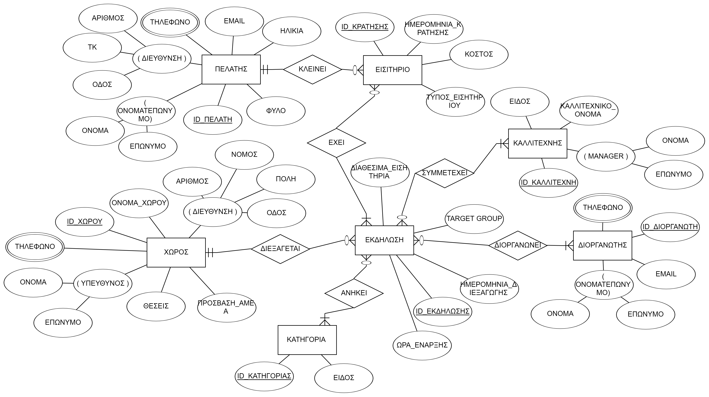
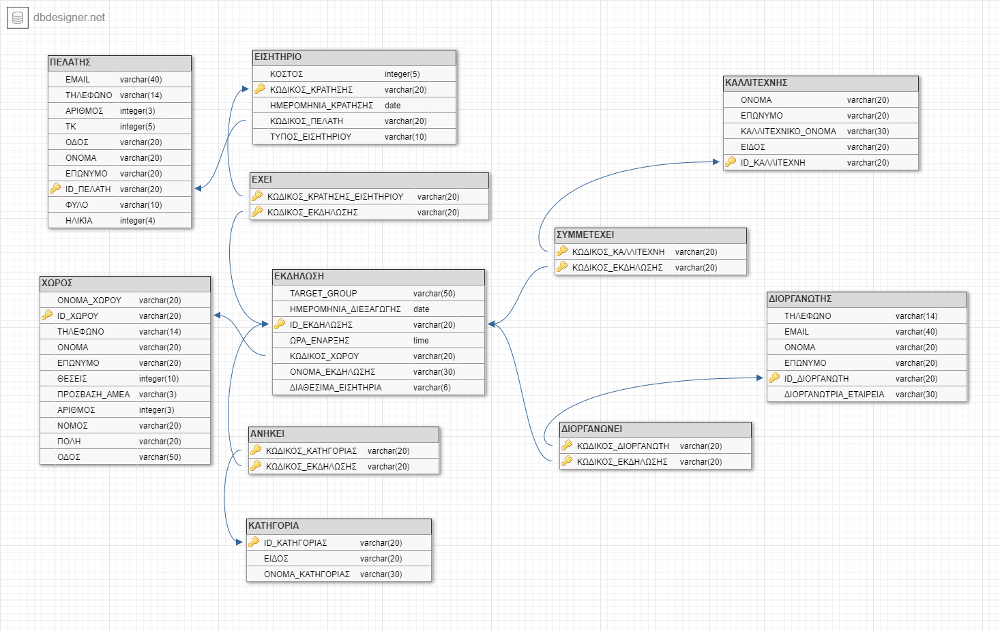

# Database Project 2019-2020
This Project was created as the final project for the course of "Database Design" 2019-2020.

## Main Task
The basic idea of the project was to create a database to manage an event search application. 
Through our application, which was developed in Python it is possible to view and edit this 
database in a user-friendly way via a a simple menu.

## ERD

## dbdesigner

## SQL 
SQL for the creation of the database can be found on "PROJECT_mysql_create.sql"

## Final Report and Setup
The final report and more details about the app and the setup  can be found on "esssay.docx" and "setup.txt".

## Contributors
* Charalampos Mastrokostas (chmastrokostas@gmail.com) 
* Stylianos Krasopoulos (stelioskrasopoulos@hotmail.com) 
